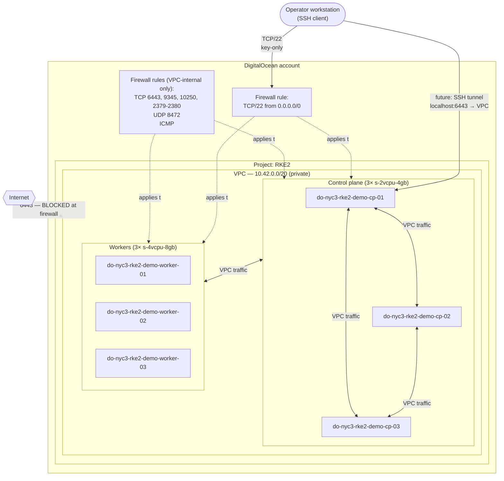
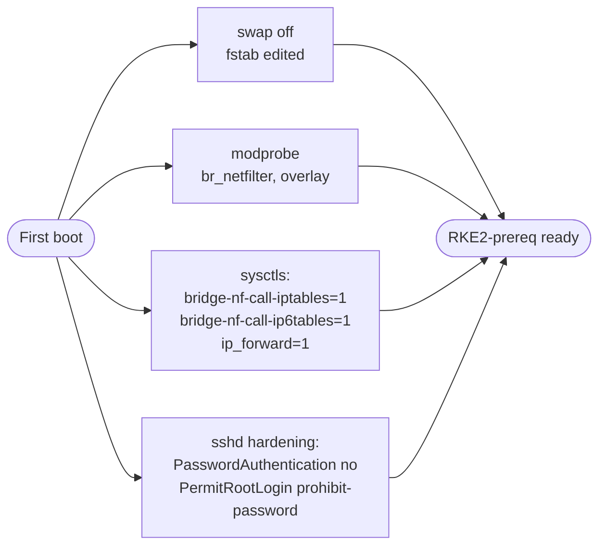

# DigitalOcean network topology — Phase 1

Logical view of the substrate provisioned by `terraform/modules/do-droplet-infra/`. RKE2 is **not** installed yet — this diagram shows what exists after a successful `make apply` of Phase 1.

## Topology

## Reachability summary

| Source                    | Destination                  | Port            | Allowed?            |
|---------------------------|------------------------------|-----------------|---------------------|
| Public internet           | Any droplet                  | TCP/22 (SSH)    | ✅ key-only          |
| Public internet           | Any droplet                  | TCP/6443 (API)  | ❌ blocked           |
| Public internet           | Any droplet                  | Any other       | ❌ blocked           |
| Droplet inside VPC        | Droplet inside VPC           | TCP 6443        | ✅                   |
| Droplet inside VPC        | Droplet inside VPC           | TCP 9345        | ✅                   |
| Droplet inside VPC        | Droplet inside VPC           | TCP 10250       | ✅                   |
| Droplet inside VPC        | Droplet inside VPC           | TCP 2379-2380   | ✅                   |
| Droplet inside VPC        | Droplet inside VPC           | UDP 8472        | ✅ (flannel VXLAN)   |
| Droplet inside VPC        | Droplet inside VPC           | ICMP            | ✅                   |
| Operator → kube API       | TCP/6443                     |                 | only via SSH tunnel |

## Boot-time host setup (cloud-init)

Every droplet runs the same cloud-init template (`cloud-init.yaml.tftpl`) on first boot:

The template is intentionally minimal and idempotent so an Ansible role can replay any of these steps later without conflict.

## What's NOT here (yet)

- **RKE2** install — landed in a follow-up change.
- **Block Storage volumes** for Longhorn — Phase 2.
- **Ansible inventory** rendered from module outputs — follow-up change.
- **Remote state backend** (DO Spaces) — follow-up issue.
- **Load balancer / floating IPs** for the kube API — TBD; until then, operator access via SSH tunnel.
