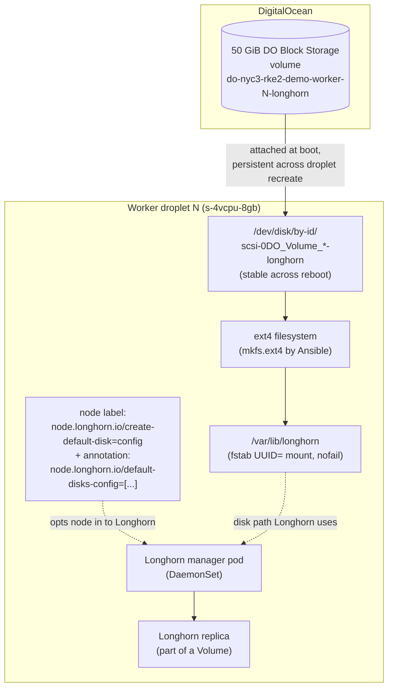
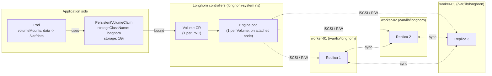

# Longhorn topology — DO volume → ext4 → mount → replica → PVC

How storage flows on each worker, and how Longhorn replicates a PVC across all three workers with hard anti-affinity. Counterpart to [`do-network.md`](do-network.md) (cluster network topology) and [`public-traffic-path.md`](public-traffic-path.md) (north-south traffic).

## Per-worker storage stack

The Ansible role `longhorn_disk_prep` runs all tasks above the Longhorn-pod boundary: stat the device, mkfs (only if blank), mount via UUID with `nofail` + `noatime`, chmod 0700 on the mount, then once `rke2-agent` is up — label + annotate the node so Longhorn opts in. CPs receive neither label nor annotation, so the Longhorn DaemonSet won't run on them and even if it did, Longhorn wouldn't auto-create a default disk.

## Cluster-wide replication

`defaultClassReplicaCount: 3` + `replicaSoftAntiAffinity: false` (HARD anti-affinity) means every Volume's 3 replicas land on 3 distinct workers — verified via `kubectl -n longhorn-system get replicas.longhorn.io -l longhornvolume=<vol>`. If a worker's volume fails or the worker is destroyed, the Volume stays healthy from the other 2 replicas; Longhorn auto-rebuilds a 3rd replica on a healthy node when one becomes available again.

## Failure model

| Failure | Consequence | Recovery |
|---|---|---|
| One worker drops out (droplet destroyed, network partition) | Volume Degraded but still R/W from the other 2 replicas. Pod stays Running on whichever node hosts an engine. | Worker comes back online → Longhorn rebuilds the missing replica. ~minutes for a 1 GiB volume. |
| One 50 GiB volume fails at DO | Same as above — Longhorn marks the disk Unschedulable, Volume stays healthy. | Replace the DO volume; re-run `make play` to mkfs + mount + relabel; Longhorn rebuilds. |
| Two simultaneous workers fail | Volume R/O degraded. Pod still has data (engine queries any live replica). | Operator scenario — restore at least one worker before any of the surviving replicas also fails. |
| All three workers fail | Data is gone (no S3 backup target wired up yet — see `longhorn-enablement.md` deferred work). | Restore from S3 backup if one exists. Otherwise: total loss. |
| Worker still up but `/var/lib/longhorn` mount lost | Longhorn marks the disk Unschedulable. Replica disappears, Volume becomes Degraded. | `nofail` mount means worker still boots; operator manually remounts. Longhorn re-discovers on next reconcile. |

## Why this layout and not alternatives

- **Why dedicated DO Block Storage, not droplet ephemeral disk?** Droplet OS disks are non-portable (a destroyed droplet loses its data); DO Block Storage volumes survive droplet destroy/recreate. Longhorn replicates anyway, but using ephemeral storage would mean every droplet recreate triggers a full rebuild.
- **Why workers only, no CP-side Longhorn?** Etcd I/O on CPs is latency-sensitive; sharing the same OS disk with Longhorn replica I/O would tail-latency etcd. Workers-only is the universal Longhorn best practice.
- **Why opt-in node labels (`createDefaultDiskLabeledNodes: true`) and not just rely on CP taints?** Two-layer defense. CP taints can be lifted by operators for other purposes (e.g., single-node demos). If/when that happens, Longhorn wouldn't suddenly create a disk on a CP's OS partition because it never received the opt-in label.
- **Why ext4 and not xfs?** Best-practices doc is silent on the choice. ext4 has simpler shrink/grow semantics; our 50 GiB volumes are well within ext4's sweet spot. Revisit XFS only for much larger volumes (multi-TiB).
- **Why UUID-based mount, not the by-id path?** DO `/dev/disk/by-id/scsi-0DO_Volume_<name>` is stable across reboots *as long as* the volume name doesn't change. Volume rename is rare but possible. UUIDs are stable across rename.

## See also

- [`docs/runbooks/longhorn-enablement.md`](../runbooks/longhorn-enablement.md) — operator procedure.
- [`ansible/roles/longhorn_disk_prep/README.md`](../../ansible/roles/longhorn_disk_prep/README.md) — Ansible role details.
- [`openspec/changes/enable-longhorn/design.md`](../../openspec/changes/enable-longhorn/design.md) — hard-isolation design discussion.
- [`do-network.md`](do-network.md) — cluster network topology.
- [`public-traffic-path.md`](public-traffic-path.md) — north-south traffic flow.
