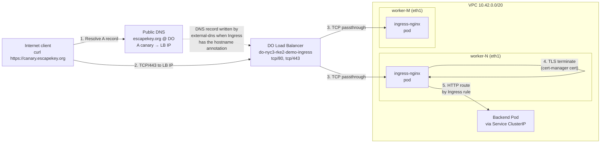

# Public traffic path — internet → DO LB → ingress-nginx → app

Counterpart to [`do-network.md`](do-network.md) (which covers the **internal** path used by `kubectl` over the SSH tunnel to the VPC-internal kube-API LB). This diagram is the **public** path that exists only after the [`install-do-ccm`](../runbooks/install-do-ccm.md) change lands.

## Sequence

## Step-by-step

1. **Client resolves `canary.escapekey.org`.** DNS lookup goes to whatever resolver the client uses, then up the chain to `ns{1,2,3}.digitalocean.com` (authoritative for `escapekey.org` since the 2026-05-16 DNS migration — see [`dns-migration-to-do.md`](../runbooks/dns-migration-to-do.md)). The `A` record returns the DO Load Balancer's public IPv4.

   The `A` record is created by **external-dns**, which watches Kubernetes Ingresses with `external-dns.alpha.kubernetes.io/hostname: <name>` annotations and writes them to DigitalOcean via the DO API. external-dns is scoped to `escapekey.org` via [`apps/external-dns/values.yaml`](../../apps/external-dns/values.yaml) `domainFilters`.

2. **Client connects TCP/443 to the LB IP.** This is the public ingress surface that this PR opens.

3. **DO LB forwards as plain TCP** to one of the ingress-nginx pods. The LB is configured for L4 passthrough (`service.beta.kubernetes.io/do-loadbalancer-protocol: tcp`) so it doesn't terminate TLS. The LB only knows the destination worker droplets — it doesn't see the SNI host or the cert.

   The set of "destination droplets" is whatever the ingress-nginx Service backs onto. With `externalTrafficPolicy: Local`, the DO LB only forwards to nodes that **have** an ingress-nginx replica running locally — so source IPs are preserved (no SNAT through a different node) and there's no extra hop.

4. **ingress-nginx terminates TLS** on whichever pod received the packet, using the certificate Secret created by cert-manager via DNS-01 (issuer `letsencrypt`, see [`apps/cert-manager-custom-resources/clusterissuer.yaml`](../../apps/cert-manager-custom-resources/clusterissuer.yaml)).

5. **ingress-nginx routes HTTP** to the backend Service based on the matching `Ingress` rule, and the Service load-balances to a backend Pod.

## How the LB came to exist

Without CCM, the ingress-nginx `Service` of `type: LoadBalancer` would sit at `EXTERNAL-IP <pending>` forever — observed in the 2026-05-16 unattended test before this change.

With CCM running, the sequence is:

1. ingress-nginx HelmRelease creates a `Service` of `type: LoadBalancer` (always has).
2. CCM's service controller watches Services. When a new `type: LoadBalancer` Service appears, it calls the DO API to create a new LB matching the Service's annotations (`size-unit`, `name`, `protocol`, etc.).
3. CCM updates the Service's `status.loadBalancer.ingress[0].ip` with the new LB's public IP.
4. external-dns sees the populated IP and writes the matching `A` record.
5. The Ingress is now publicly resolvable + reachable.

On `make destroy`, the reverse happens: tearing down the ingress-nginx Service triggers CCM to call the DO API to delete the LB. external-dns sees the IP disappear and removes the `A` record. No orphans in DO; no orphans in DNS.

## Contrast: kube-API path (internal-only)

The kube-API path uses a **separate, INTERNAL** DigitalOcean LB (`network: INTERNAL` in [`terraform/modules/do-droplet-infra/loadbalancer.tf`](../../terraform/modules/do-droplet-infra/loadbalancer.tf)) reachable only from inside the VPC. Operators tunnel into the VPC over SSH and forward `localhost:6443` to that internal LB's `10.42.0.x:6443`. The CCM doesn't touch this LB — it's provisioned by Tofu, not by Kubernetes.

That separation is intentional: control-plane traffic and application traffic never share a path, never share an LB, and never share an exposure model.

## See also

- [`do-network.md`](do-network.md) — internal cluster topology + kube-API SSH tunnel.
- [`install-do-ccm.md`](../runbooks/install-do-ccm.md) — operator procedure for enabling the public path.
- [`dns-migration-to-do.md`](../runbooks/dns-migration-to-do.md) — how `escapekey.org` ended up at DO.
