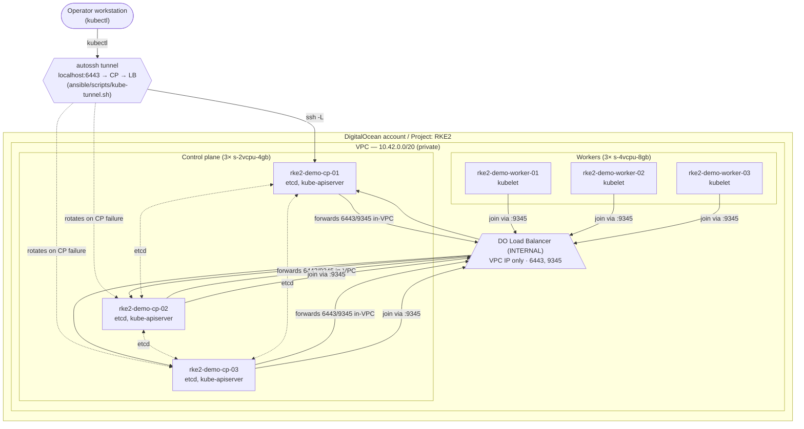

# RKE2 cluster topology — Phase 1

What runs on top of the Phase 1 DigitalOcean substrate after [`docs/runbooks/rke2-install.md`](../runbooks/rke2-install.md) succeeds.

## Cluster + operator access



## CIDR layout

| Range | What | Where |
|---|---|---|
| `10.42.0.0/20` | DigitalOcean VPC (private) | DO infra; per-droplet `eth1` |
| `10.244.0.0/16` | Kubernetes pod CIDR (`cluster-cidr`) | CNI overlay; never matches VPC traffic |
| `10.245.0.0/16` | Kubernetes service CIDR (`service-cidr`) | kube-proxy / cluster DNS |

RKE2's defaults are `10.42.0.0/16` and `10.43.0.0/16`, which overlap our VPC. We override both in `ansible/inventory/group_vars/all/main.yml`. See [`openspec/changes/add-rke2-install/design.md`](../../openspec/changes/add-rke2-install/design.md#cluster--service-cidr-overrides) for the diagnosis.

## Bring-up sequence

```mermaid
sequenceDiagram
    participant operator
    participant playbook as Ansible playbook
    participant cp1 as cp-01
    participant cp23 as cp-02 / cp-03
    participant lb as Internal LB
    participant workers

    operator->>playbook: make play
    playbook->>cp1: rke2_common
    playbook->>cp23: rke2_common
    playbook->>workers: rke2_common
    Note over cp1: probe LB:9345/ping<br/>no response, no local etcd<br/>=> cluster-init: true
    playbook->>cp1: install RKE2, start rke2-server
    cp1-->>playbook: 9345 + 6443 healthy
    playbook->>operator: fetch + rewrite kubeconfig<br/>=> ansible/artifacts/kubeconfig
    Note over cp23: probe LB:9345/ping<br/>cp-01 healthy via LB<br/>=> server: https://&lt;LB&gt;:9345
    playbook->>cp23: install RKE2, start rke2-server
    cp23->>lb: join
    lb->>cp1: forward
    playbook->>workers: install RKE2, start rke2-agent
    workers->>lb: join
```

## Tunnel + kubectl

```mermaid
sequenceDiagram
    participant kubectl
    participant tunnel as kube-tunnel.sh (autossh)
    participant cpN as Any healthy CP
    participant lb as Internal LB (VPC IP)

    kubectl->>+tunnel: localhost:6443
    tunnel->>cpN: ssh -L 6443:&lt;LB-VPC&gt;:6443 root@&lt;cpN-public&gt;
    cpN->>+lb: tcp/6443
    lb->>cpN: route to a healthy apiserver backend
    lb-->>cpN: response
    cpN-->>-tunnel: response
    tunnel-->>-kubectl: kube API response
    Note over tunnel,cpN: On CP outage,<br/>autossh exits → wrapper rotates to next CP
```

## What's NOT here yet

- **Rancher** — separate change.
- **Longhorn** — Phase 2 (requires dedicated block-storage volumes per groundrule #4).
- **FluxCD bootstrap** — Phase 3 (this is when `rke2-ingress-nginx` would have been installed; we disabled it here so FluxCD owns ingress).
- **Application ingress LB** — Phase 3 resource, separate from this internal LB.
- **etcd snapshots off-box** — RKE2 takes local snapshots by default; copying to DO Spaces is a follow-up issue.
- **Twingate** — operator-access future state; replaces `kube-tunnel.sh` when it lands.
