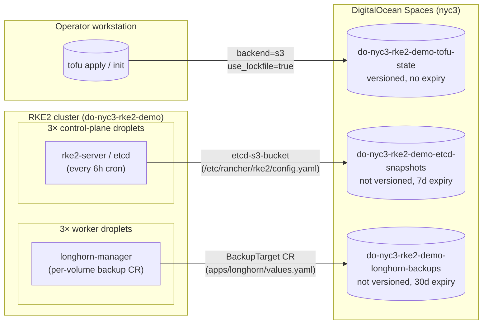
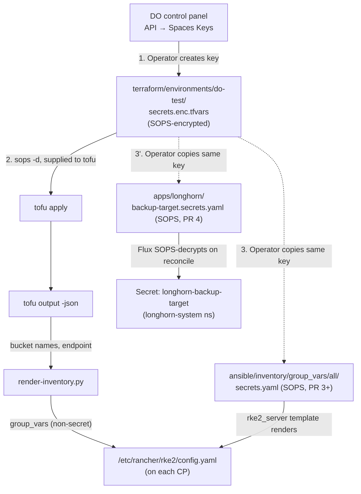

# S3 object-store topology — who writes to which bucket

Three independent consumers, one shared object-store substrate. Designed so the provider swap (DO Spaces → Wasabi for Phase 4) is `.tfvars` + SOPS-encrypted credentials only.

## Phase 3 (DO Spaces in nyc3)

Three consumers, three buckets, one Spaces access key (operator-managed, rotated in DO panel). Each consumer uses the same SOPS-encrypted credential but reads its own bucket.

## Endpoint + region naming

| Provider | Endpoint shape | Region examples | Notes |
|---|---|---|---|
| DO Spaces | `https://<region>.digitaloceanspaces.com` | `nyc3`, `sfo3`, `ams3`, `sgp1`, `fra1`, `syd1` | Region subset of droplet regions |
| Wasabi (Phase 4) | `https://s3.<region>.wasabisys.com` | `us-east-1`, `us-west-1`, `eu-central-1`, `ap-northeast-1` | Region naming is AWS-style |

`object_store_endpoint` output is derived from `var.object_store_region`; consumers don't hardcode endpoints.

## Credential flow

The Spaces access key lives in `secrets.enc.tfvars`. For PR 3 (etcd snapshots) the operator copies the same key into `ansible/inventory/group_vars/all/secrets.yaml`. For PR 4 (Longhorn backup target) the operator copies the same key into `apps/longhorn/backup-target.secrets.yaml`. One key, three SOPS files — three secret-rotation touchpoints, all using the same upstream value.

Per the proposal's decision #6: one key (per provider) supplied to all consumers. Operator can later split keys per-consumer if policy supports it; for Phase 3 simplicity wins.

## Failure model

| Failure | Consequence | Recovery |
|---|---|---|
| Spaces bucket missing | Tofu plan errors on next apply; RKE2 starts but snapshots fail; Longhorn `BackupTarget` shows `available: false` | `tofu apply` (re-creates from state). For the tofu-state bucket itself, restore from operator-local backup of the state file. |
| Spaces credentials revoked | All three consumers fail next operation: Tofu state push, etcd snapshot upload, Longhorn backup attempt | Generate a new key in DO panel; `sops` re-encrypt all three SOPS files; `make play` (re-template config.yaml); `flux reconcile` (re-apply Longhorn secret). |
| Spaces endpoint unreachable (DO outage) | Tofu apply hangs/fails; RKE2 snapshot cron fails (logs to journald); Longhorn marks backup target unavailable | Self-recovers when DO is back. Snapshots have a cron retry; Longhorn polls. |
| Lifecycle policy deletes a needed snapshot | etcd snapshot too old to restore from; Longhorn backup expired | Operator-tunable retention vars (`etcd_snapshot_retention_days`, `longhorn_backup_retention_days`); bump and `tofu apply` to extend. |
| Tofu state bucket destroyed by accident | Loss of state metadata (resources still exist in DO; Tofu can no longer manage them) | `force_destroy = false` on the bucket should prevent this; `prevent_destroy` not used because Tofu doesn't allow variable-driven prevent_destroy. Operator discipline: do not `tofu destroy` the env after state migration. Restore: re-import every resource. |

## Why this layout

- **One module, one provider abstraction** — Phase 4 swap is `.tfvars` + SOPS only. Honors CLAUDE.md groundrule #3.
- **One bucket per consumer** — different lifecycle policies, smaller blast radius if credentials leak, cleaner accounting. Cost difference negligible.
- **Operator-supplied credentials** — rotation in DO panel doesn't require a `tofu apply` to take effect on the bucket. Tofu uses the credential; doesn't manage it.
- **Versioning on tofu-state only** — state file rollback needs prior versions; snapshots + backups have their own append-only history.
- **Lifecycle on etcd + Longhorn only** — backstop in case the consumer-side retention misfires.

## See also

- [`docs/runbooks/s3-object-store-enablement.md`](../runbooks/s3-object-store-enablement.md) — operator procedure.
- [`openspec/changes/enable-s3-object-store/design.md`](../../openspec/changes/enable-s3-object-store/design.md) — file layout + Phase-4 hand-off contract.
- [`docs/diagrams/do-network.md`](do-network.md) — cluster network topology (the spaces buckets are out-of-VPC; reached via public Spaces endpoint).
