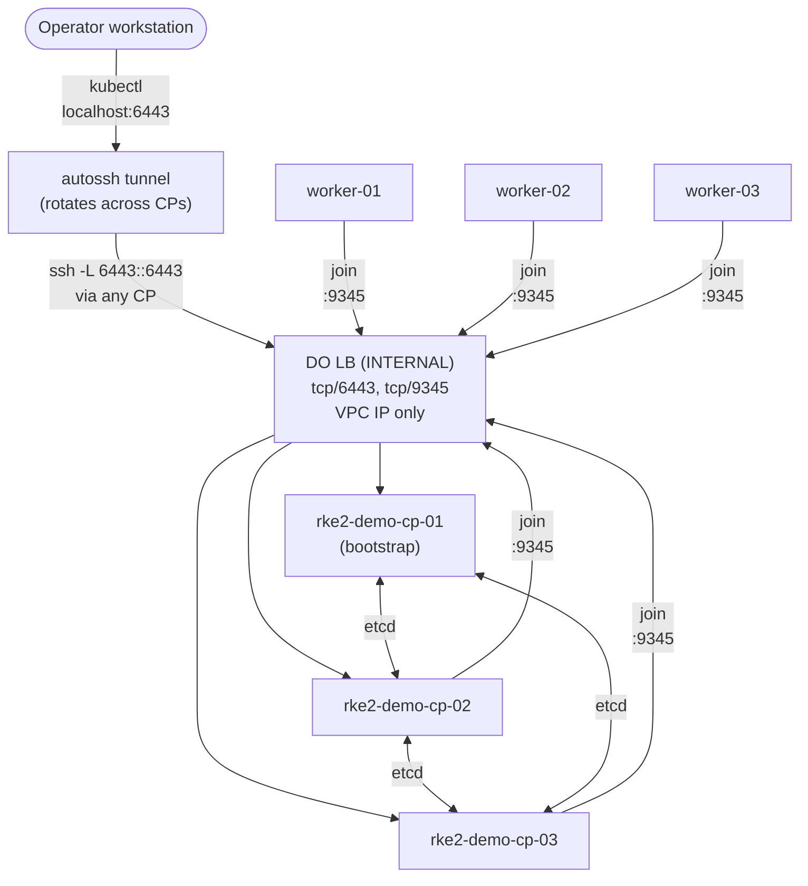

# Design — add-rke2-install

**Tracking issue:** [#6](https://github.com/geekmush/rke2-demo/issues/6)

## Cluster topology

- **Bootstrap CP** = `rke2-demo-cp-01`. Starts RKE2 with `cluster-init: true` on first boot. Generates the cluster identity (etcd CA, etc.) and accepts the pre-shared server token.
- **Other CPs** = `rke2-demo-cp-02`, `rke2-demo-cp-03`. Join via `server: https://<cp_endpoint>:9345` with the same server token. Become full etcd members and additional kube-apiserver replicas.
- **Workers** = `rke2-demo-worker-01..03`. Join the same supervisor endpoint using the agent token.
- **CP endpoint** = DO Load Balancer (`digitalocean_loadbalancer` with `network = "INTERNAL"`) -- VPC-only, no public IP -- with two TCP forwarding rules:
  - `tcp/6443 -> tcp/6443` on the 3 CPs (kube-apiserver)
  - `tcp/9345 -> tcp/9345` on the 3 CPs (RKE2 supervisor)
  - Health check: TCP probe on 9345 (RKE2 supervisor is up before kube-apiserver, so this gates the LB earlier).
  - The LB's VPC IP is listed in `tls-san` so kube-apiserver certs are valid for in-cluster traffic that lands via the LB.



## Why DO Load Balancer instead of pinning to cp-01

| Concern | Pin to cp-01 | DO LB |
|---|---|---|
| Existing nodes survive cp-01 down | Yes (etcd quorum) | Yes |
| **New joins survive cp-01 down** | No — supervisor unreachable | Yes |
| Re-rolling cp-01 cleanly | Forces config rewrite on all other nodes | No-op (LB target update is automatic) |
| Phase 4 bare-metal shape | Forces refactor | Same shape, swap LB for kube-vip |
| Cost | $0 | ~$12/mo for `lb-small` |
| Tofu addition | None | 1 resource |

LB cost is rounding-error against the $216/mo droplet baseline.

## Token strategy

Two pre-shared tokens, both 64-character hex strings (`openssl rand -hex 32`):

- `rke2_server_token` — used by CPs to join the cluster.
- `rke2_agent_token` — used by workers to join the cluster.

Both stored in `ansible/inventory/group_vars/all/secrets.enc.yaml`, SOPS-encrypted with the operator age key. Loaded automatically via `community.sops` vars plugin during the play. The plugin's default `valid_extensions` is `.sops.*`, so `ansible.cfg` widens it to `.enc.yml,.enc.yaml,.enc.json` to match this repo's existing convention.

Written into `/etc/rancher/rke2/config.yaml` on each node (mode `0600`, root-owned). RKE2 reads tokens from config at service start.

**Why pre-generated**:

- Avoids the bootstrap dance ("SSH to cp-01, cat node-token, re-run Ansible").
- Idempotent — re-running the play does not regenerate tokens.
- Re-rolling cp-01 doesn't break joins.

**Two tokens, not one**: agents do not need to be able to join as servers. The split limits blast radius if a worker is compromised.

## Inventory generation

Static rendering. Not a dynamic inventory plugin.

Flow:

```
tofu -chdir=terraform/environments/do-test output -json
  -> ansible/scripts/render-inventory.py
  -> ansible/inventory/generated.yaml  (gitignored)
```

`render-inventory.py` is a zero-dep Python script (stdlib only, runs under `uv` per groundrule #1 via `#!/usr/bin/env -S uv run --script`). It reads the Tofu JSON output, expects:

- `cp_nodes` — list of `{name, public_ip, private_ip, id}`
- `worker_nodes` — same shape
- `cp_endpoint` — LB VPC IP (new in this change; regional DO LBs don't expose a hostname attribute in the current provider version)
- `vpc_cidr` — for inventory-level vars

…and emits a YAML inventory with two groups (`rke2_servers`, `rke2_agents`), `ansible_host` set to **public IP** (operator reaches them over SSH), and a host var for `private_ip` (RKE2 binds and advertises on private IPs).

A wrapper in `ansible/Makefile`:

```
make inventory      # regenerate generated.yaml
make play           # site.yml against generated.yaml
make play-check     # --check --diff
make kubeconfig     # print export commands + how to start the tunnel
make tunnel         # start the autossh tunnel (foreground)
make lint           # ansible-lint roles/ playbooks/
```

Rejected alternative — `community.general.terraform_state` plugin:

- Reads state directly. Once #3 (remote state on DO Spaces) lands, the plugin needs Spaces credentials at every `ansible-playbook` invocation. Static render only needs them once (for `tofu output`) and the produced YAML works offline.
- The static YAML is also a debug artifact — a human can read and edit it.

## Role responsibilities

### `roles/rke2_common`

OS prereqs that cloud-init already did, but replayed for idempotence and to cover drift / manual changes:

- Confirm swap off (`swapoff -a` if active, fstab grep + fail if uncommented swap entry remains).
- Ensure `br_netfilter` and `overlay` modules loaded + persisted.
- Ensure bridge-nf and `ip_forward` sysctls set + persisted.
- Confirm sshd password auth off (drop-in present).
- Idempotent. Safe to run twice. Reports `changed=0` on a healthy host.

### `roles/rke2_server`

- Template `/etc/rancher/rke2/config.yaml` from `templates/config.yaml.j2`:
  - `token: {{ rke2_server_token }}`
  - `agent-token: {{ rke2_agent_token }}` (so this CP also accepts agents joining)
  - `node-ip: {{ private_ip }}`, `node-external-ip` omitted (kept private)
  - `advertise-address: {{ private_ip }}`
  - `tls-san:` list including `cp_endpoint`, all CP public IPs (operator SSH-tunnel use), all CP private IPs, optionally a cluster domain.
  - `disable: ['rke2-ingress-nginx']`
  - `cluster-init: true` **only** if `inventory_hostname == groups['rke2_servers'][0]` AND no etcd state exists on disk yet — otherwise omit. (See "Re-rolling cp-01" below.)
  - `server:` URL set to `https://{{ cp_endpoint }}:9345` on non-bootstrap CPs.
- Run the pinned RKE2 install script with `INSTALL_RKE2_VERSION` and `INSTALL_RKE2_TYPE=server`.
- `systemctl enable --now rke2-server.service`.
- Wait for `:9345/ping` then `:6443/healthz` to return 200 (with timeout and reasonable retry).
- On cp-01 only: fetch `/etc/rancher/rke2/rke2.yaml`, rewrite `server:` URL to `https://{{ cp_endpoint }}:6443`, drop to `ansible/artifacts/kubeconfig` (gitignored).

### `roles/rke2_agent`

- Template `/etc/rancher/rke2/config.yaml`:
  - `token: {{ rke2_agent_token }}`
  - `server: https://{{ cp_endpoint }}:9345`
  - `node-ip: {{ private_ip }}`
- Install script with `INSTALL_RKE2_TYPE=agent`.
- `systemctl enable --now rke2-agent.service`.
- No healthcheck wait — server roles already gated on healthy supervisor.

## Bootstrap-vs-join: re-rolling cp-01

The naive `cluster-init: true on groups['rke2_servers'][0]` logic breaks the moment cp-01 is destroyed and recreated by Tofu — the new cp-01 has no etcd state and would re-init a fresh cluster, severing cp-02/cp-03.

Solution: gate `cluster-init: true` on **both** conditions:

1. `inventory_hostname == groups['rke2_servers'][0]`, AND
2. `/var/lib/rancher/rke2/server/db/etcd` does **not** exist on this host AND the LB has no healthy backends behind it yet.

Practical Ansible implementation: `pre_tasks` in `playbooks/site.yml` queries the LB's target health via `curl` against `cp_endpoint:9345/ping`. If any backend answers, the cluster already exists, so the new cp-01 should **join**, not init.

This is the trickiest piece of the change. The runbook documents the manual recovery if it ever gets stuck.

## RKE2 installation method

Use the official install script with a pinned version:

```
curl -sfL https://get.rke2.io \
  | INSTALL_RKE2_VERSION="v1.30.x+rke2r1" \
    INSTALL_RKE2_TYPE=server \
    sh -
```

- `INSTALL_RKE2_VERSION` pinned in `ansible/group_vars/all/main.yml`.
- No `curl|bash` of moving HEAD — version pin is mandatory.
- The install script is itself fetched at play time; this is acceptable because RKE2 maintains it and we can pin the script SHA via `INSTALL_RKE2_COMMIT` if a stricter posture is needed later (flagged as a follow-up consideration, not blocking).

Alternative considered: install from the deb repo (`https://rpm.rancher.io/rke2/...`). Equally valid; the official script is simpler and what upstream docs lead with. Revisit if we ever need to install RKE2 in air-gapped envs.

## Cluster + service CIDR overrides

RKE2's defaults are:

- `cluster-cidr: 10.42.0.0/16` (pod network)
- `service-cidr: 10.43.0.0/16` (service IPs)

Both overlap the existing nyc3 VPC at `10.42.0.0/20`. When the CNI installs its pod-network routes, those routes **shadow** the VPC's `/20` in the kernel routing table; the symptom is `ip route get <peer-VPC-IP>` returning `RTNETLINK answers: Invalid argument` and inter-droplet VPC traffic going dark. The internal LB still works because the LB's IP gets a /32 route claimed by something earlier in the path; CP-to-CP and CP-to-worker private-IP traffic does not.

Two ways to fix: move the VPC, or move the CIDRs. We can't easily move the VPC -- DO marks our VPC as nyc3's default and explicitly refuses both deletion (`Can not delete default VPCs`) and demotion (`Can not unset default VPCs`). Demoting it would require creating another VPC, promoting *it* to default via the DO API, doing Tofu state surgery to swap, and (optionally) deleting the now-empty old VPC. Each of those steps is destructive or out-of-Tofu, and the workaround leaves either a stranded empty VPC or a manual API-deletion outside Tofu's view.

So this change moves the CIDRs instead. In `ansible/inventory/group_vars/all/main.yml`:

```yaml
rke2_cluster_cidr: "10.244.0.0/16"
rke2_service_cidr: "10.245.0.0/16"
```

The RKE2 server config template emits them verbatim. `10.244` is widely used as a kube pod CIDR in upstream examples; `10.245` is unrelated to anything well-known. Both are well clear of any reasonable VPC range.

## TLS SANs

`tls-san` in the server config includes:

- `cp_endpoint` (LB **VPC** IP -- the LB is INTERNAL).
- All 3 CP private IPs (in-VPC traffic between CPs).
- `127.0.0.1` is added automatically by RKE2 for localhost callers (this is what the operator kubeconfig points at, reached via SSH tunnel).
- `cluster.local` is the default cluster domain -- RKE2 already adds it.

If we add a DNS name in front of the LB later (e.g. `rke2.example.com`), it gets appended to `tls-san` -- change is one line in `group_vars`.

## Kube API access path

The CP load balancer is **`network = "INTERNAL"`** -- VPC-only, no public IP. Reaching it from the operator workstation requires an SSH tunnel through any CP. Operator `kubectl` then talks to `localhost:6443`, which the tunnel forwards through the CP into the VPC and onto the LB.

```
kubectl on operator workstation
    │
    ▼
localhost:6443  ──── SSH tunnel ────► <CP-public-IP> ──── VPC ────► <LB-VPC-IP>:6443
                                                                          │
                                                                          ├── cp-01:6443
                                                                          ├── cp-02:6443
                                                                          └── cp-03:6443
```

Why not an EXTERNAL LB with an IP allowlist? The original design tried that. It fails because DO LBs **preserve the original client source IP** when forwarding TCP traffic. The droplet firewall (per the CLAUDE.md access model) restricts `6443`/`9345` to VPC-internal sources only, so the LB-forwarded traffic arrives at the backend droplet with the operator's *public* source IP and gets dropped. The fixes (either loosen the droplet firewall to `0.0.0.0/0` on `6443/9345` or run two LBs) are unnecessary in this repo's context:

- The **application** ingress load balancer is a separate Phase 3 resource, provisioned by FluxCD on top of an ingress controller. Not this LB.
- The long-term operator access path is **Twingate** (a ZTNA connector inside the VPC). That makes the LB's external reachability redundant: Twingate connects from inside the VPC, so the droplet firewall stays strict and the LB has no external exposure to worry about.

So this LB exists only to serve **CP-to-CP and worker-to-CP join traffic** -- VPC-internal by definition -- and a Twingate connector or an SSH tunnel handles operator access.

### Operator SSH tunnel (`ansible/scripts/kube-tunnel.sh`)

A small `bash` wrapper around `autossh`. Pseudocode:

```bash
read CP_HOSTS + LB_IP from `tofu output -json`
loop forever:
    for host in CP_HOSTS:
        autossh -M 0 -N -L 6443:LB_IP:6443 root@host
        # autossh keeps the connection alive across network blips
        # if the host itself goes down past ServerAliveCountMax, autossh exits
        rotate to next host
        re-read tofu output (picks up re-rolled droplet IPs)
```

- Run in foreground via `make -C ansible tunnel`. Ctrl-C to stop.
- The operator's kubeconfig (`ansible/artifacts/kubeconfig`) has its `server:` URL rewritten to `https://127.0.0.1:6443` by the `rke2_server` role at play time -- so kubectl just works once the tunnel is up.
- Failure modes: transient SSH drops -> autossh respawns automatically; persistent CP outage -> the inner `for` loop moves to the next CP after `ServerAliveCountMax * ServerAliveInterval` (~20s with current settings).
- Future Twingate setup replaces this script with a Twingate Resource pointing at the LB VPC IP; the operator's kubectl path is otherwise unchanged.

### Kubeconfig handling

After cp-01 is healthy, the playbook slurps `/etc/rancher/rke2/rke2.yaml`, rewrites the `server:` URL from `https://127.0.0.1:6443` (RKE2's on-host default) to **`https://127.0.0.1:6443`** -- unchanged in value, but written to the operator workstation. The path resolves via `{{ playbook_dir }}/../artifacts/kubeconfig`, which is `.../ansible/artifacts/kubeconfig`. Mode `0600`, since it's a cluster-admin credential.

```bash
# In one terminal:
make -C ansible tunnel

# In another:
export KUBECONFIG=$(pwd)/ansible/artifacts/kubeconfig
kubectl get nodes
```

Or merge into `~/.kube/config` via `kubectl config view --flatten` after a one-time `KUBECONFIG=~/.kube/config:ansible/artifacts/kubeconfig`.

### Fallback if `kube-tunnel.sh` itself is unavailable

SSH to any CP and use the on-host kubeconfig directly:

```bash
ssh -i ~/.ssh/rke2_demo_ed25519 root@<any-cp-public-ip>
KUBECONFIG=/etc/rancher/rke2/rke2.yaml kubectl get nodes
```

That kubeconfig points at `https://127.0.0.1:6443` on the CP itself and works without any tunnel because it talks to that CP's own apiserver.

## Idempotence and re-rolls

- `ansible-playbook playbooks/site.yml` is safe to run twice. The roles use Ansible modules with proper change detection — no `command:` invocations that re-execute on every run.
- Re-rolling a worker: `tofu taint` + `apply`, then `make -C ansible play --limit <worker>`. Role detects fresh node, joins as agent.
- Re-rolling a non-bootstrap CP: same flow. Joins as server.
- Re-rolling cp-01: per the bootstrap-vs-join logic above — joins, does not re-init.

## Disabled RKE2 components

This change disables exactly one default RKE2 addon:

- `rke2-ingress-nginx` — FluxCD installs ingress in Phase 3.

Defaults left enabled:

- `rke2-coredns` — cluster DNS.
- `rke2-metrics-server` — base metrics.
- `rke2-snapshot-controller` + `rke2-snapshot-validation-webhook` — even though Longhorn isn't here yet, the controllers do no harm idle.

May be revisited before Phase 3 (e.g. disable snapshot-controller until Longhorn lands).

## Secrets handling (groundrule #9)

| File | Contents | Encrypted |
|---|---|---|
| `ansible/inventory/group_vars/all/main.yml` | Non-secret defaults: RKE2 version, disabled components, cluster/service CIDRs, port numbers, kubeconfig path | No (committed plaintext) |
| `ansible/inventory/group_vars/all/secrets.enc.yaml` | `rke2_server_token`, `rke2_agent_token` | SOPS+age |
| `ansible/artifacts/kubeconfig` | Cluster admin kubeconfig | Gitignored, operator-local |
| `ansible/inventory/generated.yaml` | IPs (not secrets but transient) | Gitignored |

(group_vars/host_vars live under `inventory/` rather than at the ansible/ root because Ansible's `host_group_vars` plugin resolves them relative to the inventory file, not the playbook or the project root. With our inventory at `ansible/inventory/generated.yaml`, group_vars belong at `ansible/inventory/group_vars/`.)

`.gitignore` updates:

- `ansible/artifacts/`
- `ansible/inventory/generated.yaml`
- `ansible/.galaxy-cache/`
- Existing `*.enc.yaml` allowlist already covers `secrets.enc.yaml`.

## Risks / open questions

- **etcd snapshots**: RKE2 ships native snapshot scheduling on by default, written to `/var/lib/rancher/rke2/server/db/snapshots/`. This change uses RKE2 defaults for retention but does NOT off-box snapshots. A node failure that takes the disk with it would lose its snapshots. A follow-up issue (filed after merge) tracks copying snapshots to DO Spaces.
- **Install script fetch from internet**: RKE2 install script is fetched at play time. If `get.rke2.io` is unreachable, install fails. Acceptable for test phase; documented in the runbook.
- **Single LB**: the internal LB is presented as one DO resource. DO has internal redundancy under the hood, but a region-wide LB outage would block new cluster joins. Existing nodes survive (etcd quorum, in-cluster networking) -- it's a join-time concern only. Bare-metal Phase 4 swaps the LB for kube-vip, which removes this single point of dependency.
- **No CIS hardening**: production phase will revisit.

### Discovered during implementation (kept here so the rationale survives in the archive)

- **DO LBs preserve the source IP** when forwarding TCP. Combined with the CLAUDE.md access model restricting RKE2 inter-node ports to VPC-internal sources, this killed the first design (EXTERNAL LB with an operator CIDR allowlist). Resolution: switch the LB to `network = "INTERNAL"`. See decisions #4 in `proposal.md`.
- **DO marks one VPC per region as default** and refuses to delete or demote it via API. The first time the test environment is brought up, the user's VPC for nyc3 becomes the default. This blocks any `vpc_cidr` change in Tofu (since `ip_range` is `ForceNew`). Resolution: keep the VPC at `10.42.0.0/20` and override RKE2's CIDRs instead. See "Cluster + service CIDR overrides" above.
- **The `community.sops.sops` vars plugin defaults to `.sops.*` extensions.** Our repo convention is `.enc.*`. Resolution: set `valid_extensions = .enc.yml,.enc.yaml,.enc.json` in the `[community.sops]` section of `ansible.cfg`.
- **Ansible relative paths in `delegate_to: localhost` resolve from the playbook's directory**, not the inventory's or the project root. The kubeconfig was initially writing to `ansible/playbooks/artifacts/kubeconfig`. Resolution: use `{{ playbook_dir }}/../artifacts/kubeconfig` so the destination is an absolute, predictable path regardless of where `ansible-playbook` is invoked from.

## Hand-off contract to the next change

Likely follow-ups:

1. `add-rancher-install` — Rancher on top of this cluster via Helm.
2. `add-etcd-snapshot-offsite` — copy snapshots to DO Spaces (small).
3. `add-ansible-lint-ci` — once any CI lands.

Module/role contract for follow-ups:

- `rke2_common`, `rke2_server`, `rke2_agent` roles are stable. Rancher install is a new role/playbook that consumes the same inventory.
- The `cp_endpoint` Tofu output is stable. Anything else that needs to reach the cluster reads it.
