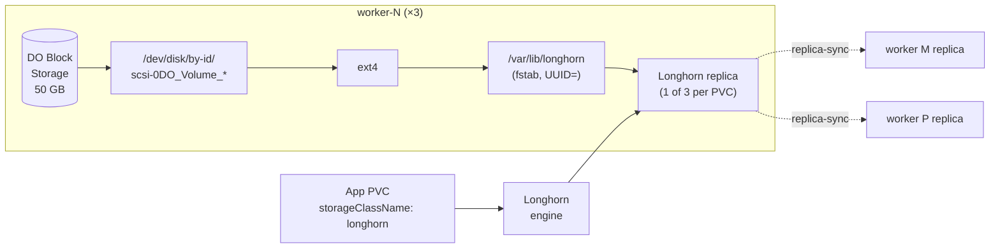

# Design — enable-longhorn

**Tracking issue:** TBD
**Status:** revision 2 (2026-05-17) — see proposal.md "Pre-flight findings"

## File layout (additions + edits)

```
ansible/
├── roles/
│   └── longhorn_disk_prep/                  # new
│       ├── defaults/main.yml
│       ├── tasks/main.yml
│       └── README.md
├── playbooks/cluster.yml                    # edit -- add longhorn_disk_prep before rke2_agent on workers
└── scripts/render-inventory.py              # edit -- emit `longhorn_device` per-worker host_var
                                             #         from Tofu output `worker_longhorn_devices`

apps/longhorn/
├── release.yaml                             # edit -- bump chart 1.10.0 → 1.11.2
├── values.yaml                              # edit -- defaultClass: true, hard-isolation knobs
├── kustomization.yaml                       # edit -- drop deleted resources, drop secretGenerator
├── evanstest.secrets.yaml                   # DELETE (upstream-key-encrypted)
├── longhorn-crypto.secrets.yaml             # DELETE (upstream-key-encrypted)
└── longhorn-crypto-global.sc.yaml           # DELETE (depends on the deleted Secret)

deploy.sh                                    # edit -- rke2 branch: add longhorn.yaml to app_list

docs/
├── runbooks/longhorn-enablement.md          # new
└── diagrams/longhorn-topology.md            # new
```

No Tofu changes — `add-do-block-storage` already shipped the substrate.

No new file `apps/longhorn/helm_secrets.yaml` is created — the `secretGenerator` block in `kustomization.yaml` referencing it is removed entirely. We have no Helm-values secrets for Longhorn (no S3 backup wired up, no encryption-at-rest secrets).

## Ansible role: `longhorn_disk_prep`

**Inputs:**
- `longhorn_device` — required string, the stable device path. Populated by `render-inventory.py` from Tofu output `worker_longhorn_devices` (`render-inventory.py` edit is part of this change).
- `longhorn_mount_path` — default `/var/lib/longhorn`.
- `longhorn_filesystem` — default `ext4`.

**Tasks (idempotent), in order:**

1. `stat` the device path. Fail loudly with a clear message if missing — that means Phase 2 didn't run or the device path drifted.
2. Inspect with `community.general.filesystem` module — does the device already have a filesystem? If yes and it's `ext4`, skip mkfs. If yes and it's something else, fail (operator decision: wipe is not automatic).
3. `community.general.filesystem` `fstype=ext4 dev={{ longhorn_device }}` — creates ext4 only if no FS present (`force: false`).
4. `ansible.posix.mount` with `state=mounted`, `path={{ longhorn_mount_path }}`, `src=UUID={{ <uuid from blkid> }}`, `fstype=ext4`, `opts=defaults,nofail`. Persists in `/etc/fstab`; `nofail` ensures a missing/unattached volume doesn't block boot.
5. `file` to ensure `0700 root:root` on the mount point. (Stricter than the chart's default `0755` — Longhorn runs privileged anyway and the tighter mode reduces blast radius if a manager pod is compromised.)
6. **Apply the Longhorn opt-in label** to the node via `kubectl label node $(hostname) node.longhorn.io/create-default-disk=config --overwrite`. Done on the worker itself with the kubelet's kubeconfig (`/etc/rancher/rke2/rke2.yaml`).
7. **Apply the Longhorn disks-config annotation** via `kubectl annotate node $(hostname) node.longhorn.io/default-disks-config='[{"path":"/var/lib/longhorn","allowScheduling":true,"storageReserved":0,"tags":["dedicated"]}]' --overwrite`. Same kubeconfig.

Steps 6 + 7 only fire if rke2-agent is running and has registered the node — gated by an `until: kubectl get node $(hostname)` retry-loop.

**Why UUID-based mount, not device path:**
- DO `/dev/disk/by-id/scsi-0DO_Volume_<name>` is stable across reboots *as long as* the volume name doesn't change. Volume rename is rare but possible.
- UUID is stable across rename and across re-import. `/etc/fstab` survives both.
- The role still uses the by-id path for the *initial* mkfs decision (deterministic, comes from Tofu); the *mount* indirects through blkid → UUID immediately.

**Placement in playbook:**

```yaml
# ansible/playbooks/cluster.yml (snippet)
- hosts: workers
  become: true
  roles:
    - role: common
    - role: longhorn_disk_prep        # NEW -- mkfs + mount BEFORE rke2_agent;
                                       # node label + annotation AFTER (handled inside the role)
    - role: rke2_agent
```

The role's mkfs+mount tasks (1-5) run as part of the role's `tasks/main.yml`, before `rke2_agent`. The label+annotation tasks (6-7) are conditional — they wait for `kubectl get node $(hostname)` to succeed, which only happens after `rke2_agent` has registered the node. This is intentional ordering inside a single role rather than splitting into two roles: keeps the per-worker Longhorn substrate setup in one logical unit.

Workers-only. CPs receive neither the label nor the annotation, so even if their `NoSchedule` taint is ever removed, Longhorn physically cannot create a disk on them.

## Hard isolation — values.yaml + node-side enforcement together

Two layers of defense ensure Longhorn never touches OS disk space:

### Layer 1: chart values
```yaml
# apps/longhorn/values.yaml
persistence:
  defaultClass: true                  # was: false
  defaultClassReplicaCount: 3
  defaultDataLocality: disabled

defaultSettings:
  createDefaultDiskLabeledNodes: true     # OPT-IN per node; no node gets a disk by accident
  defaultDataPath: /var/lib/longhorn      # explicit; matches the Ansible-managed mount
  replicaSoftAntiAffinity: false          # HARD anti-affinity → 3 replicas on 3 distinct workers
  storageReservedPercentageForDefaultDisk: 0  # nothing else uses this disk
  storageMinimalAvailablePercentage: 10   # dedicated → lower from default 25
  upgradeChecker: false                   # GitOps-managed upgrades, not in-band notifier
```

`createDefaultDiskLabeledNodes: true` is the critical knob. Without it, the chart's default behavior is "create a default disk on every node Longhorn sees" — which would put a disk on every worker AND every CP (if CP taints ever lift).

### Layer 2: per-node opt-in
The Ansible role applies the matching `node.longhorn.io/create-default-disk=config` label + `node.longhorn.io/default-disks-config` annotation on workers only. The annotation's JSON `path: /var/lib/longhorn` AND `storageReserved: 0` settings tell Longhorn "use exactly this path, don't carve out anything for non-Longhorn use."

With both layers in place: a CP node (no label) → Longhorn ignores it. A worker node (label + annotation but no mount) → Longhorn would try `/var/lib/longhorn` and find it's on the OS partition. The `nofail` mount + the ordered role (mount BEFORE label) prevents that — by the time the label is applied, `/var/lib/longhorn` is the dedicated 50 GB ext4.


## apps/longhorn/ cleanup (revision 2)

Revision 1 attempted to keep all three vendored secrets and re-encrypt them. Revision 2's research found:

1. `evanstest.secrets.yaml` — S3 backup-target credentials for the upstream author's test environment. Encrypted with upstream's age key (we can't decrypt). Not load-bearing for our install. **DELETE.**
2. `longhorn-crypto.secrets.yaml` — per-volume crypto key for the encrypted StorageClass. Encrypted with upstream's age key. **DELETE.**
3. `longhorn-crypto-global.sc.yaml` — encrypted StorageClass that references the deleted Secret. Without the Secret, any PVC using this SC would hang Pending forever. **DELETE.** Re-introduce in a separate future change when there's a real encryption-at-rest requirement, designed around a key-management plan we explicitly make.
4. `helm_secrets.yaml` — referenced by `kustomization.yaml`'s `secretGenerator` but missing from disk. We have no Helm-values secrets for Longhorn. **REMOVE the secretGenerator block** from `kustomization.yaml` entirely; do not supply an empty file.

After cleanup, `apps/longhorn/` contains:
```
release.yaml          # HelmRelease, chart 1.11.2 (bumped from 1.10.0)
kustomization.yaml    # resources: [release.yaml]; configMapGenerator for values; NO secretGenerator
kustomizeconfig.yaml  # unchanged
values.yaml           # heavily edited per "Hard isolation" above
```

`kustomize build apps/longhorn/` MUST render cleanly post-cleanup — verify before committing.

## deploy.sh edit

Current (`deploy.sh:162-173`):

```bash
  rke2)
    # TEMPORARY (Phase 3b only): longhorn dropped so we can validate the
    # rest of the platform first. Phase 3c restores it once we've:
    # 1. replaced upstream-author-encrypted *.secrets.yaml files under
    #    apps/longhorn/ with our own age-recipient encryption
    # 2. set:
    #     app_list="longhorn.yaml"
    # alongside the longhorn-config fixes (replace upstream-author-encrypted
    # secrets and wire the per-worker disk paths from the Tofu output
    # `worker_longhorn_devices`).
    app_list=""
    ;;
```

After:

```bash
  rke2)
    app_list="longhorn.yaml"
    ;;
```

Drop the whole TEMPORARY comment — once the change merges, the TODO is done and the comment is a confusing fossil.

## Diagram outline (`docs/diagrams/longhorn-topology.md`)



Plus a short note on PVC binding flow and the per-worker mount lineage.

## Risks / open questions

- **DO Block Storage UUID drift on first format**: `blkid` after mkfs gives the canonical UUID. The Ansible role must read it *after* mkfs and use that value in the fstab line — not pre-compute. Verified in role design above.
- **`nofail` mount option** means a missing volume produces a degraded but bootable worker. Acceptable for a substrate that depends on cluster-level redundancy anyway; a fully-failed volume just means that worker can't host Longhorn replicas, which the scheduler handles.
- **First-bring-up race**: Longhorn pods come up before the disk-prep run if the order is wrong. Mitigated by playing `longhorn_disk_prep` before `rke2_agent` in `cluster.yml` — the kubelet doesn't even register the node until after disk prep.
- **Replicas-on-same-worker bug** if `replicaSoftAntiAffinity` is wrong: easy to verify (`kubectl -n longhorn-system get volumes.longhorn.io -o wide`).
- **Encrypted-SC functionality** is intentionally broken by Recommendation A. Documented in the runbook and in the PR description; not a regression because we never used it.
- **`make -C ansible inventory`** must already render `worker_longhorn_devices` into host_vars for the role to consume. If it doesn't, that's a small one-line addition to the inventory script — flagged in tasks.md.

## Hand-off contract to Phase 4 (bare-metal)

When the bare-metal migration starts, the Longhorn config above stays the same — only the Ansible role's input changes:

- `longhorn_device` becomes a per-host fact set from hardware inventory (e.g. `/dev/disk/by-id/wwn-0x...`) instead of from Tofu output.
- `longhorn_filesystem` may change if we want XFS for very large volumes; ext4 still works.
- Everything from the mount point down (Longhorn values, StorageClasses, replica policy) is provider-agnostic.

That portability is the reason `longhorn_disk_prep` is a standalone role with a single device-path input, not a DO-specific play.
