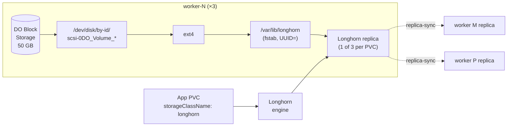

# Design — enable-longhorn

**Tracking issue:** TBD

## File layout (additions + edits)

```
ansible/
└── roles/
    └── longhorn_disk_prep/                  # new
        ├── defaults/main.yml
        ├── tasks/main.yml
        ├── handlers/main.yml
        └── README.md

ansible/playbooks/cluster.yml                # edit -- add longhorn_disk_prep before rke2_agent on workers

apps/longhorn/
├── values.yaml                              # edit -- persistence.defaultClass: true, explicit defaultDataPath
├── helm_secrets.yaml                        # edit -- re-encrypt with our age recipients
├── longhorn-crypto.secrets.yaml             # edit -- re-encrypt (or delete if unused)
└── evanstest.secrets.yaml                   # edit -- re-encrypt (or delete if unused)

deploy.sh                                    # edit -- rke2 branch: app_list="longhorn.yaml"

docs/
├── runbooks/longhorn-enablement.md          # new
└── diagrams/longhorn-topology.md            # new
```

No Tofu changes — `add-do-block-storage` already shipped the substrate.

## Ansible role: `longhorn_disk_prep`

**Inputs:**
- `longhorn_device` — required string, the stable device path. Populated from `tofu output -json worker_longhorn_devices | jq -r '.["<hostname>"]'` at inventory-render time (the existing `ansible/Makefile inventory` target already pulls Tofu outputs).
- `longhorn_mount_path` — default `/var/lib/longhorn`.
- `longhorn_filesystem` — default `ext4`.

**Tasks (idempotent):**

1. `stat` the device path. Fail loudly with a clear message if missing — that means Phase 2 didn't run or the device path drifted.
2. Inspect with `community.general.filesystem` module — does the device already have a filesystem? If yes and it's `ext4`, skip mkfs. If yes and it's something else, fail (operator decision: wipe is not automatic).
3. `community.general.filesystem` `fstype=ext4 dev={{ longhorn_device }}` — creates ext4 only if no FS present (`force: false`).
4. `ansible.posix.mount` with `state=mounted`, `path={{ longhorn_mount_path }}`, `src=UUID={{ <uuid from blkid> }}`, `fstype=ext4`, `opts=defaults,nofail`. Persists in `/etc/fstab`; `nofail` ensures a missing/unattached volume doesn't block boot.
5. `file` to ensure `0755 root:root` on the mount point.

**Why UUID-based mount, not device path:**
- DO `/dev/disk/by-id/scsi-0DO_Volume_<name>` is stable across reboots *as long as* the volume name doesn't change. Volume rename is rare but possible.
- UUID is stable across rename and across re-import. `/etc/fstab` survives both.
- The role still uses the by-id path for the *initial* mkfs decision (deterministic, comes from Tofu); the *mount* indirects through blkid → UUID immediately.

**Handlers:** none. Mount is `state=mounted` (apply now), not `state=present` (write fstab only).

**Placement in playbook:**

```yaml
# ansible/playbooks/cluster.yml (snippet)
- hosts: workers
  become: true
  roles:
    - role: common
    - role: longhorn_disk_prep        # NEW -- before rke2_agent
    - role: rke2_agent
```

Workers-only. CPs get nothing.

## Longhorn values.yaml diff (semantic)

```yaml
persistence:
  defaultClass: true                       # was: false
  defaultClassReplicaCount: 3              # unchanged
  volumeBindingMode: "Immediate"           # unchanged

defaultSettings:
  defaultDataPath: "/var/lib/longhorn"     # was: ~  -- explicit for clarity
  # createDefaultDiskLabeledNodes: ~       # unchanged; default = auto-create on every node
  replicaSoftAntiAffinity: false           # NEW -- force replicas onto different nodes (hard anti-affinity)
```

`replicaSoftAntiAffinity: false` is the hard-anti-affinity setting (counter-intuitive naming: "soft" = false means "no, don't soften it"). With 3 workers and 3 replicas, every PVC's replicas land on a unique worker — matching the success criterion.

## SOPS secret re-encryption

The three files arrived encrypted with the upstream template author's age recipient. Per `.sops.yaml` rules, they need to round-trip through our recipients:

```bash
# For each file:
sops -d apps/longhorn/<file> > /tmp/decrypted          # fails currently -- not our key
# -- or, if we cannot decrypt at all (which is the case for evanstest/longhorn-crypto):
#    delete or replace from scratch.
sops -e --age <our-recipient> /tmp/decrypted > apps/longhorn/<file>
shred -u /tmp/decrypted
```

**Reality check:** `evanstest.secrets.yaml` and `longhorn-crypto.secrets.yaml` are upstream sample secrets we never had the plaintext for. They're not load-bearing for a clean install (the encrypted SC's referenced Secret can be regenerated from scratch with a fresh AES-256 key if we ever want encryption-at-rest). Three options:

- **A. Delete both files** + remove from `apps/longhorn/kustomization.yaml`. Cleanest. The encrypted SC stops working until we recreate the Secret, but we're not using it as default anyway. Recommended.
- **B. Keep the encrypted SC** (`longhorn-crypto-global.sc.yaml`) but generate a fresh secret encrypted to our recipients with a new AES-256 key. Use only if we want the encrypted SC functional from day one.
- **C. Leave them encrypted-with-upstream-key.** They'll fail to decrypt at apply time. Rejected.

**Recommendation: A.** Land the encrypted-SC story as a follow-up change if/when there's a workload that needs it.

`helm_secrets.yaml` is a different story — it's the chart's Secret-sourced values overlay (per `apps/longhorn/kustomization.yaml`'s `secretGenerator`). Check whether it has any content we need; if it's empty / sample-only, replace with an empty-but-encrypted-by-us file. If it has values we need, re-encrypt or rewrite.

## deploy.sh edit

Current (`deploy.sh:162-173`):

```bash
  rke2)
    # TEMPORARY (Phase 3b only): longhorn dropped so we can validate the
    # rest of the platform first. Phase 3c restores it once we've:
    # 1. replaced upstream-author-encrypted *.secrets.yaml files under
    #    apps/longhorn/ with our own age-recipient encryption
    # 2. set:
    #     app_list="longhorn.yaml"
    # alongside the longhorn-config fixes (replace upstream-author-encrypted
    # secrets and wire the per-worker disk paths from the Tofu output
    # `worker_longhorn_devices`).
    app_list=""
    ;;
```

After:

```bash
  rke2)
    app_list="longhorn.yaml"
    ;;
```

Drop the whole TEMPORARY comment — once the change merges, the TODO is done and the comment is a confusing fossil.

## Diagram outline (`docs/diagrams/longhorn-topology.md`)



Plus a short note on PVC binding flow and the per-worker mount lineage.

## Risks / open questions

- **DO Block Storage UUID drift on first format**: `blkid` after mkfs gives the canonical UUID. The Ansible role must read it *after* mkfs and use that value in the fstab line — not pre-compute. Verified in role design above.
- **`nofail` mount option** means a missing volume produces a degraded but bootable worker. Acceptable for a substrate that depends on cluster-level redundancy anyway; a fully-failed volume just means that worker can't host Longhorn replicas, which the scheduler handles.
- **First-bring-up race**: Longhorn pods come up before the disk-prep run if the order is wrong. Mitigated by playing `longhorn_disk_prep` before `rke2_agent` in `cluster.yml` — the kubelet doesn't even register the node until after disk prep.
- **Replicas-on-same-worker bug** if `replicaSoftAntiAffinity` is wrong: easy to verify (`kubectl -n longhorn-system get volumes.longhorn.io -o wide`).
- **Encrypted-SC functionality** is intentionally broken by Recommendation A. Documented in the runbook and in the PR description; not a regression because we never used it.
- **`make -C ansible inventory`** must already render `worker_longhorn_devices` into host_vars for the role to consume. If it doesn't, that's a small one-line addition to the inventory script — flagged in tasks.md.

## Hand-off contract to Phase 4 (bare-metal)

When the bare-metal migration starts, the Longhorn config above stays the same — only the Ansible role's input changes:

- `longhorn_device` becomes a per-host fact set from hardware inventory (e.g. `/dev/disk/by-id/wwn-0x...`) instead of from Tofu output.
- `longhorn_filesystem` may change if we want XFS for very large volumes; ext4 still works.
- Everything from the mount point down (Longhorn values, StorageClasses, replica policy) is provider-agnostic.

That portability is the reason `longhorn_disk_prep` is a standalone role with a single device-path input, not a DO-specific play.
